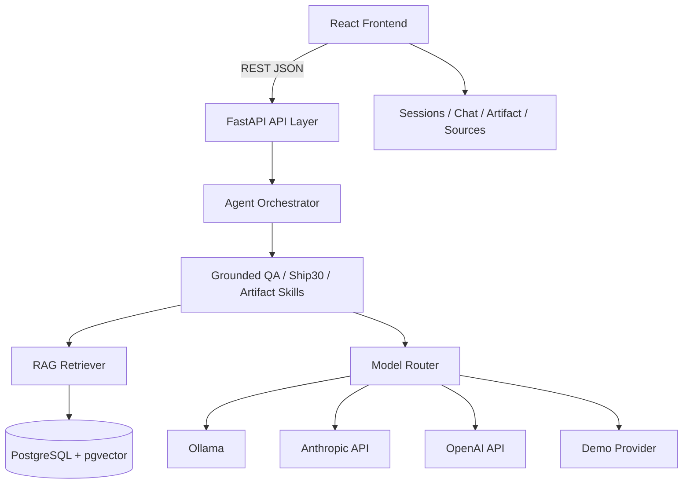

# Architecture: Lenny Growth Assistant

## System Overview
The application is a full-stack AI research and strategy workspace built around a grounded RAG pattern. The frontend is a React + TypeScript + Vite app for conversations, session management, sources, and generated artifacts. The backend is a FastAPI service that manages the database, oral model routing, transcripts, and retrieval.

---

## Component Boundaries

### Frontend
The frontend is located under [frontend/src](frontend/src) and is organized around domain-specific UI modules.

- App shell and routing: [frontend/src/App.tsx](frontend/src/App.tsx)
- Session management: [frontend/src/components/SessionSidebar/SessionSidebar.tsx](frontend/src/components/SessionSidebar/SessionSidebar.tsx)
- Chat UI: [frontend/src/components/Chat/ChatInput.tsx](frontend/src/components/Chat/ChatInput.tsx) and [frontend/src/components/Chat/ChatMessages.tsx](frontend/src/components/Chat/ChatMessages.tsx)
- Artifact rendering: [frontend/src/components/ArtifactViewer/ArtifactViewer.tsx](frontend/src/components/ArtifactViewer/ArtifactViewer.tsx)
- Source list: [frontend/src/components/SourceList/SourceList.tsx](frontend/src/components/SourceList/SourceList.tsx)
- Model switching: [frontend/src/components/ModelSelector/ModelSelector.tsx](frontend/src/components/ModelSelector/ModelSelector.tsx)
- API integration: [frontend/src/services/api.ts](frontend/src/services/api.ts)
- State hooks: [frontend/src/hooks/useChat.ts](frontend/src/hooks/useChat.ts), [frontend/src/hooks/useSessions.ts](frontend/src/hooks/useSessions.ts), and [frontend/src/hooks/useResizablePanel.ts](frontend/src/hooks/useResizablePanel.ts)

Responsibilities of the frontend:
- Render landing and studio experiences
- Keep session state and chat state in React hooks
- Submit requests to the backend
- Display artifacts, citations, and retrieved sources
- Provide provider selection and session navigation

### Backend
The backend is under [backend/app](backend/app) and is split by functional concern.

- Application bootstrapping: [backend/app/main.py](backend/app/main.py)
- Environment and defaults: [backend/app/config.py](backend/app/config.py)
- Database models: [backend/app/db/models.py](backend/app/db/models.py)
- Repositories: [backend/app/db/repositories.py](backend/app/db/repositories.py)
- API routes: [backend/app/api](backend/app/api)
- Orchestration: [backend/app/agents/orchestrator.py](backend/app/agents/orchestrator.py)
- Skill implementations: [backend/app/agents/skills](backend/app/agents/skills)
- Retrieval and embeddings: [backend/app/rag](backend/app/rag)
- Model adapters: [backend/app/llm](backend/app/llm)
- Output sanitization: [backend/app/security/artifact_sanitizer.py](backend/app/security/artifact_sanitizer.py)

Responsibilities of the backend:
- Persist sessions, artifacts, documents, and chunks
- Detect the user intent and route to the right skill
- Retrieve transcript evidence and embed queries
- Call LLM providers with consistent interfaces
- Protect generated artifacts from unsafe HTML content

---

## Database Schema
The database is Postgres with pgvector enabled. The schema is defined in [backend/app/db/models.py](backend/app/db/models.py).

### Users
Stores either a direct user or a minimal identity record for the app.

- id: UUID primary key
- display_name: optional name
- created_at, updated_at

### Sessions
Represents a chat thread.

- id: UUID primary key
- user_id: nullable UUID foreign key to users
- title: conversation title
- created_at, updated_at
- messages: one-to-many relationship
- artifacts: one-to-many relationship

### Messages
Stores chat history and metadata.

- id: UUID primary key
- session_id: foreign key to sessions
- role: user or assistant
- content: message text
- model_used: string or null
- sources: JSON metadata for citations
- created_at

### Documents
Stores transcript metadata and raw content.

- id: UUID primary key
- source_key: unique key for deduplication
- title
- url
- speaker
- raw_text
- metadata_json
- created_at, updated_at

### Chunks
Each transcript is split into chunks and embedded as vectors.

- id: UUID primary key
- document_id: foreign key to documents
- chunk_index
- text
- embedding: pgvector column
- metadata_json
- content_hash
- created_at

This supports similarity search and provenance tracking back to a source transcript.

### Artifacts
Stores generated output from the assistant workflow.

- id: UUID primary key
- session_id: foreign key to sessions
- type: markdown or html
- title
- content
- css: optional styling payload
- metadata_json
- created_at

### Relationship notes
- Session deletion cascades to messages and artifacts.
- Document deletion cascades to supporting chunks.
- Chunks are indexed by content hash and document id to prevent duplicate ingestion.

---

## API Endpoints
The API is organized by route prefix and exposed in the FastAPI app at [backend/app/main.py](backend/app/main.py).

### Health
- GET /api/health
- GET /api/health/ollama

These endpoints check that the backend is active and whether the local Ollama service is reachable.

### Sessions
- POST /api/sessions
- GET /api/sessions
- GET /api/sessions/{session_id}
- DELETE /api/sessions/{session_id}

These endpoints create, list, fetch, and delete chat sessions.

### Chat
- POST /api/chat

This is the main interaction endpoint. It validates the session, routes the message through the orchestrator, then returns the answer, sources, and optional artifact payload.

### Artifacts
- POST /api/artifacts

This endpoint creates a generated artifact linked to a session. It may call the Ship 30 or artifact-generation skill and persist the final output.

### Models
- GET /api/models
- PATCH /api/models/active

These endpoints expose available providers and allow the active provider to be switched at runtime.

### Root
- GET /

Returns service metadata and links to the API docs endpoint.

---

## Ingestion and Retrieval Flow

### Ingestion
The transcript ingestion pipeline is implemented in [backend/app/rag/ingestion.py](backend/app/rag/ingestion.py).

1. Read markdown or text files from the transcript directory.
2. Parse metadata such as title, URL, and speaker using the chunking helpers.
3. Upsert the document into the documents table.
4. Split content into chunks with the chunking logic.
5. Compute a deterministic hash for each chunk.
6. Skip duplicates if the hash already exists.
7. Embed each chunk with the configured embedding model.
8. Save the chunk and embedding into PostgreSQL with pgvector.

This creates a local knowledge base from source content that can be queried later.

### Retrieval
The retrieval layer is in [backend/app/rag/retrieval.py](backend/app/rag/retrieval.py).

- The query is embedded with the configured embedding model.
- The system uses pgvector cosine distance for the main retrieval path.
- If pgvector fails, it falls back to a Python cosine similarity implementation.
- Results are ranked by relevance and filtered by a minimum threshold.
- Retrieved chunks are converted into source citations and context blocks.

The retriever formats a grounded context string that is inserted into the LLM prompt. This is the core mechanism that prevents unsupported or hallucinated responses.

---

## Agent Routing and Skill Design
The orchestration boundary is in [backend/app/agents/orchestrator.py](backend/app/agents/orchestrator.py).

Intent detection is handled by [backend/app/agents/tools.py](backend/app/agents/tools.py), which identifies whether a prompt is asking for:

- general grounded Q&A
- a Ship 30 essay
- a generated artifact in markdown or HTML

Then the orchestrator routes to a skill.

### Grounded Q&A skill
[backend/app/agents/skills/grounded_qa.py](backend/app/agents/skills/grounded_qa.py)

- Retrieves relevant chunks
- Builds grounded prompts
- Returns answer content and citations
- Explicitly handles insufficient context

### Ship 30 skill
[backend/app/agents/skills/ship30.py](backend/app/agents/skills/ship30.py)

- Uses transcript evidence to generate a structured essay or strategy output
- Persists the resulting artifact in the artifact table
- Returns both content and source metadata

### Artifact generation skill
[backend/app/agents/skills/artifact_gen.py](backend/app/agents/skills/artifact_gen.py)

- Produces markdown or HTML artifacts from grounded context
- Applies sanitization rules before persistence
- Returns the artifact type, title, and content

This pattern keeps the orchestrator thin and the skills specialized.

---

## Model Toggle and Routing
The model selection system is centralized in [backend/app/llm/router.py](backend/app/llm/router.py).

Supported providers:
- Ollama
- Anthropic
- OpenAI
- Demo fallback

The active provider can be changed through the API or by setting environment defaults. The router exposes:

- list_models
- get_provider
- get_provider_with_fallback
- complete_with_fallback

The settings file contains the default values and environment-driven configuration in [backend/app/config.py](backend/app/config.py).

Defaults include:
- model_provider: ollama
- ollama_model: llama3.2
- ollama_embed_model: nomic-embed-text
- anthropic_model: configured by environment
- openai_model: configured by environment
- demo_fallback_enabled: optional

Fallback behavior:
- If Ollama is unavailable and the demo fallback is enabled, the system routes to the demo provider.
- If a cloud provider fails due to missing or invalid credentials, it raises a structured LLMError that the API converts to a 503 response.
- This preserves clear failure semantics instead of silently pretending the request succeeded.

---

## Security Model
The application takes a layered approach to trust and content safety.

### Backend sanitization
[backend/app/security/artifact_sanitizer.py](backend/app/security/artifact_sanitizer.py) removes dangerous HTML patterns and uses bleach to allow only a limited, safe subset of tags and attributes.

Blocked or stripped patterns include:
- script tags
- iframe and object embeds
- javascript: URLs
- inline event handlers
- CSS imports and expression-based behavior

### API risk boundaries
- The frontend never calls LLM providers directly.
- All model calls happen from the backend service.
- The CORS configuration in [backend/app/main.py](backend/app/main.py) limits cross-origin exposure.

### Artifact isolation and rendering
Generated artifact content is stored and rendered in a controlled format so that user-generated or model-generated HTML does not become arbitrary executable content. The backend sanitizes HTML before persistence, and the frontend presents it in a constrained UI environment.

---

## Deployment Topology
The project supports local development and a lightweight multi-container setup described in [docker-compose.yml](docker-compose.yml) and [start.sh](start.sh).

### Local development topology
- PostgreSQL service running on port 5432
- FastAPI backend running on port 8000 or through the local app runner
- Frontend Vite app running on port 5173
- Ollama running locally or reachable via host networking

### Docker topology
Containerized runtime includes:
- postgres: database and vector extension support
- backend: application service
- frontend: web app and static asset serving during development

### Host connectivity assumptions
The backend is configured to use local host addresses for Ollama and database connectivity. On macOS, Docker-based services commonly reach the host through host.docker.internal or the local machine loopback configuration depending on the environment.

---

## Failure and Recovery Patterns
The system is designed to fail explicitly and recover predictably.

- Missing provider credentials produce LLM errors with 503 responses.
- Ollama downtime can trigger a demo fallback when enabled.
- Empty retrieval results do not produce fabricated citations; they should return an honest insufficient-context answer.
- Sanitization failures strip dangerous content and log warnings rather than allowing it to pass through.

This preserves reliability, traceability, and trust in the product behavior.

---

## Summary
The architecture combines a carefully scoped orchestration layer, grounded retrieval, provider abstraction, and a durable Postgres schema. The design keeps responsibilities separated across frontend, backend, retrieval, and model layers so the app remains testable, debuggable, and resilient while supporting both local Ollama workflows and cloud-model fallback paths.
